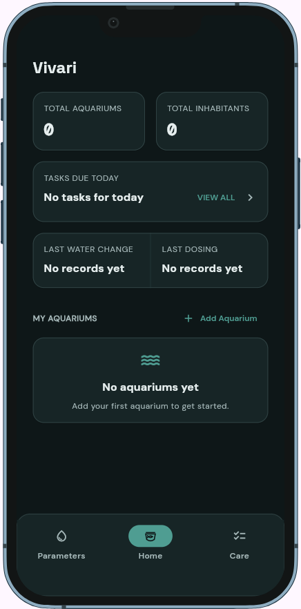

## 1. Overview

- Vivari (Derived from vivarium ; Latin for "place of life") is an aquarium care app designed to help aquarium owners keep track of their aquariums, water parameters, and care tasks. 
- Live Demo: https://vvnrzn.github.io/Vivari/

## 2. Setup and installation

The specific SDK versions used to build the app are **Flutter 3.47.2** and **Dart 3.13.2**.

To run the project:

1. Install Flutter and ensure the Flutter toolchain is on your `PATH`.
2. Clone the repository and open its folder in VS Code or a terminal.
3. Install the project dependencies:

```bash
flutter pub get
```

4. Check that Flutter can detect a connected device or emulator:

```bash
flutter devices
```

## 3. How to run it

Start the app with:

```bash
flutter run
```

For a browser preview:

```bash
flutter run -d chrome
```

The app opens to the **Home Dashboard**. Its bottom navigation provides access to **Parameters** and **Care**, which are still placeholders.

## 4. Features and usage

### Home

* View total aquariums, inhabitants, tasks due today, parameter alerts, last water change, and last dosing.
* Browse aquarium cards and select an aquarium to view its details.
* Use **+ Add Aquarium** to create a new aquarium.
* Select **Tasks Due Today** or **Parameter Alerts** to quickly open Care or Parameters.

### Aquarium Details

* View aquarium information, tasks needing attention, and inhabitants.
* Edit aquarium details or add and manage inhabitants.
* Use **+ Add Inhabitant** to add fish, invertebrates, plants, or corals.

### Parameters

* Switch between aquariums and view water-quality parameters.
* Monitor temperature, ammonia, nitrite, nitrate, pH, salinity, and other enabled parameters.
* Use **+ Add** to record measurements and quickly switch between parameters.
* Open a parameter to view its graph, status, average, and recommended range.
* Use Parameter Settings to manage visible parameters and recommended values.

### Care

* View maintenance tasks through List, Week, Calendar, or History.
* Filter tasks by aquarium and review overdue, due today, and upcoming tasks.
* Use **+ Add** to create a single or recurring task and assign it to one or more aquariums.
* View completed tasks through History.


## 5. Project structure

```text
lib/
├── main.dart
├── screens/
│   ├── home_dashboard.dart
│   ├── aquarium_details_screen.dart
│   ├── parameters_screen.dart
│   ├── care_screen.dart
│   └── placeholder_screen.dart
├── theme/
│   └── app_theme.dart
└── widgets/
    ├── empty_state.dart
    ├── summary_card.dart
    ├── vivari_bottom_navigation.dart
    └── vivari_card.dart
```

## 6. Screenshots



- Parameters, Care, and Aquarium Details are still placeholder screens in development.

## 7. Known issues and next steps

Current limitations:
- Aquarium, inhabitant, task, water change, and dosing information is not connected to stored app data. The dashboard currently shows zero counts and empty-state messages.
- Parameters, Care, and Aquarium Details are placeholders.
- “Add Aquarium” opens a temporary placeholder instead of an aquarium creation form.
- The app does not currently include a data persistence workflow.
Planned next steps:
1. Build the aquarium creation and details workflow.
2. Implement water parameter tracking.
3. Build care task management and maintenance records.
4. Connect dashboard summaries to app data.
5. Add and document screenshots, demo details, and project author information.


