# Vivari

**Live Demo:** https://vvnrzn.github.io/Vivari/  
**Course:** Applications Development and Emerging Technologies (6ADET), Holy Angel University  
**Author:** vvnrzn  

## 1. Overview
- Vivari is a Flutter-based aquarium care app designed to help aquarium owners keep track of their aquariums, water parameters, and care tasks. It aims to bring aquarium summaries and maintenance information together in one place.

## 2. Setup and installation

The specific SDK versions used to build the app are **Flutter 3.47.2** and **Dart 3.13.2**.

To run the project:

1. Install Flutter and ensure the Flutter toolchain is on your `PATH`.
2. Clone the repository and move into its folder:

```bash
git clone https://github.com/vvnrzn/Vivari.git
cd Vivari
```

3. Install the project dependencies:

```bash
flutter pub get
```

4. Check that Flutter can detect a connected device or emulator:

```bash
flutter devices
```

## 3. How to run it

Start the app with:

```bash
flutter run
```

For a browser preview:

```bash
flutter run -d chrome
```


## 4. Features and usage

### Home

* View total aquariums, inhabitants, tasks due today, parameter alerts, last water change, and last dosing.
* Browse aquarium cards and select an aquarium to view its details.

### Aquarium Details

* View aquarium information, tasks needing attention, and inhabitants.
* Filter inhabitants by type, add matching freshwater or saltwater species, and edit quantities.
* Search the local mock catalog by common name, scientific name, and keywords.
* The current catalog is stored in `assets/data/inhabitants.json`; no catalog API is required.

### Parameters

* Switch between aquariums and view water-quality parameters.
* Monitor temperature, ammonia, nitrite, nitrate, pH, salinity, and other enabled parameters.
* Open a parameter to view its graph, status, average, and recommended range.
* Use Parameter Settings to manage visible parameters and recommended values.

### Care

* View maintenance tasks through List, Week, Calendar, or History.
* Filter tasks by aquarium and review overdue, due today, and upcoming tasks.
* View completed tasks through History.


## 5. Project structure

```text
assets/
└── data/
    └── inhabitants.json
lib/
├── main.dart
├── data/
│   └── inhabitant_catalog.dart
├── models/
│   ├── aquarium.dart
│   ├── care_record.dart
│   ├── inhabitant.dart
│   └── water_reading.dart
├── screens/
│   ├── add_aquarium_screen.dart
│   ├── add_inhabitant_screen.dart
│   ├── add_task_screen.dart
│   ├── aquarium_details_screen.dart
│   ├── care_screen.dart
│   ├── home_dashboard.dart
│   ├── log_activity_screen.dart
│   ├── parameters_screen.dart
│   └── placeholder_screen.dart
├── theme/
│   └── app_theme.dart
└── widgets/
    ├── aquarium_multi_select_sheet.dart
    ├── empty_state.dart
    ├── summary_card.dart
    ├── vivari_add_button.dart
    ├── vivari_bottom_navigation.dart
    └── vivari_card.dart
```

## 6. Screenshots

| Area | Screen | Screenshot |
| --- | --- | --- |
| Home | Dashboard | 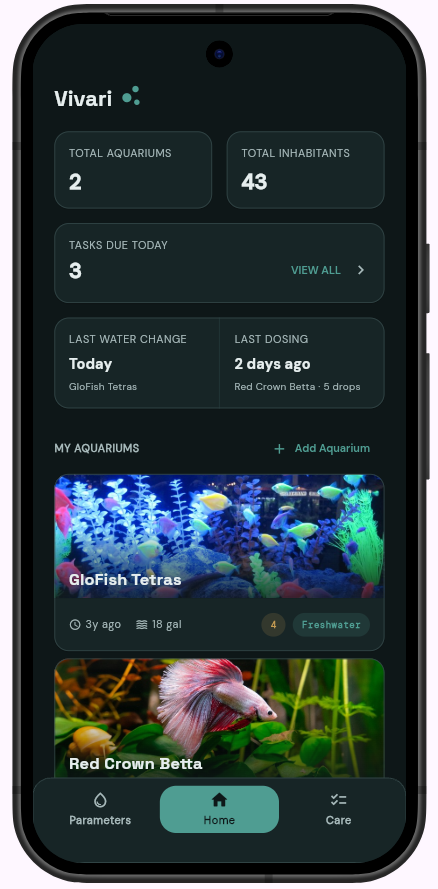 |
| Aquarium management | Aquarium details | 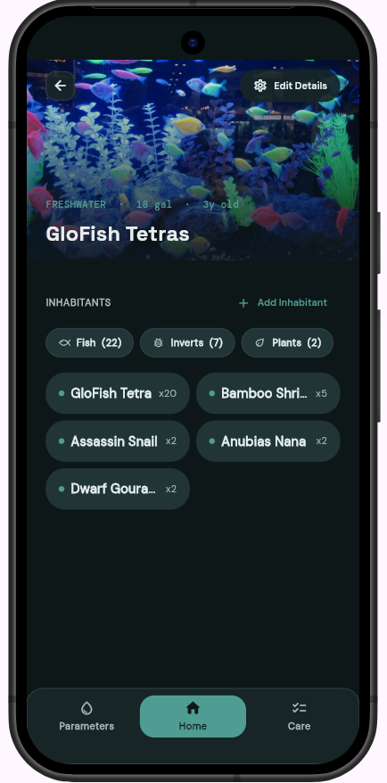 |
| Aquarium management | Add aquarium | 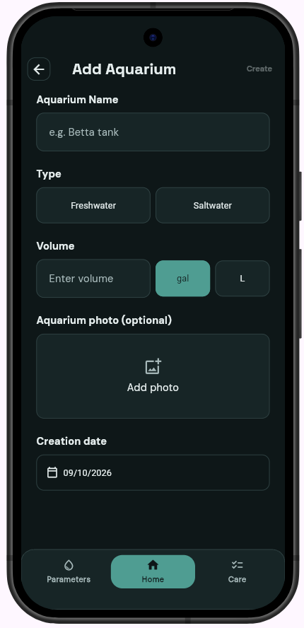 |
| Aquarium management | Edit aquarium | 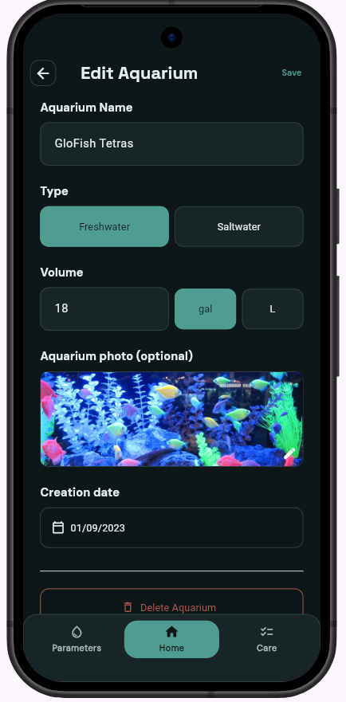 |
| Aquarium management | Add inhabitant | 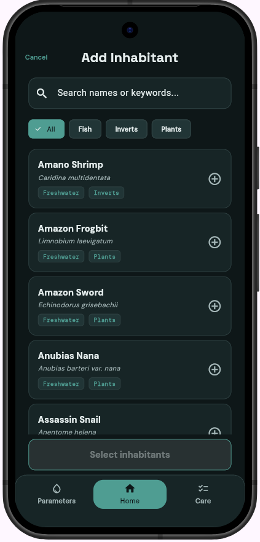 |
| Parameters | Parameter overview | 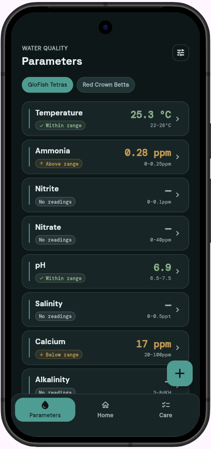 |
| Parameters | Add parameter reading | 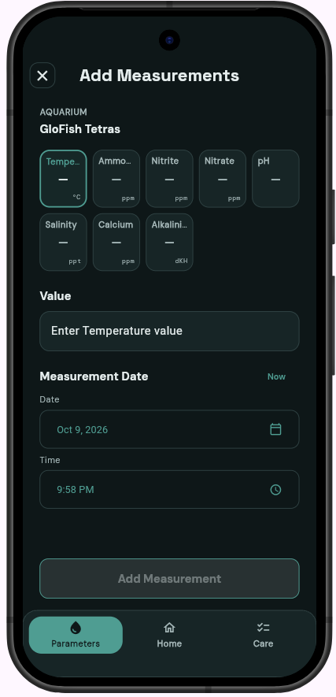 |
| Parameters | Parameter details and chart | 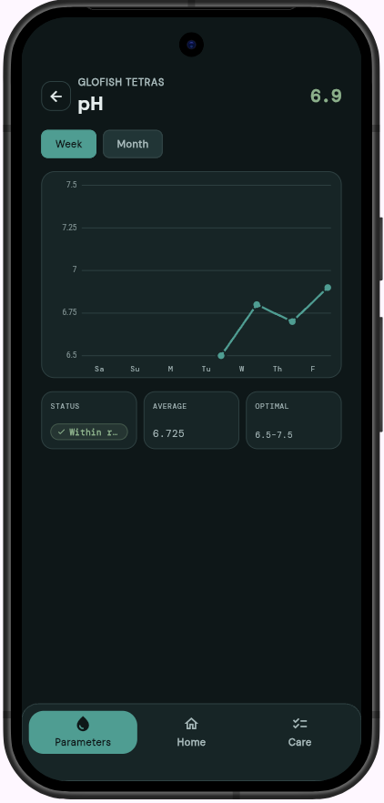 |
| Parameters | Parameter settings | 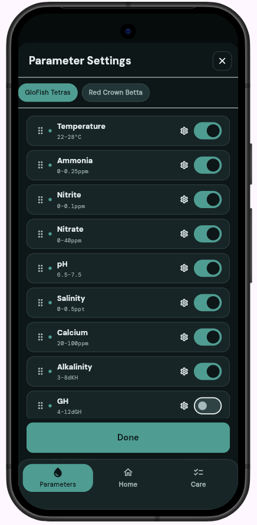 |
| Care | Care overview | 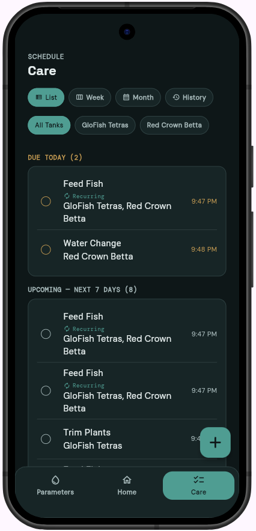 |
| Care | Add task | 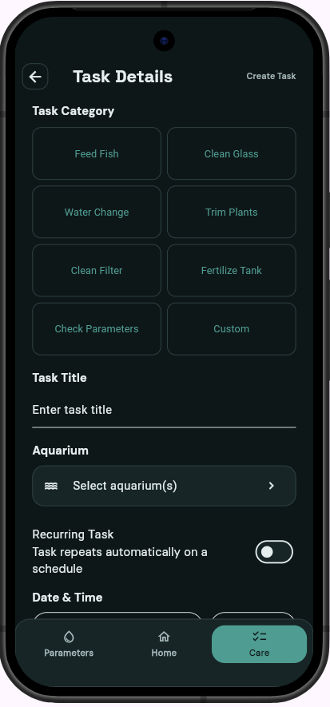 |
| Care | Log activity | 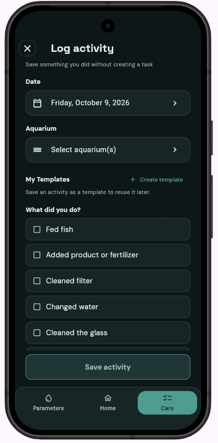 |


## 7. Known issues and next steps

**Current limitations:**

* Aquarium, care-task, and water-reading data is held in memory and is lost when the app is closed or restarted.
* The inhabitant search uses the bundled local catalog; it does not yet fetch species suggestions from an external database or API.
* Parameter charts currently offer Week and Month views. A custom date range from the proposal is not available yet.
* Maintenance notifications are not implemented. The proposal expects local notifications to require a supported device, so web support will need a fallback.

**Planned next steps:**

* Add local data persistence so aquarium records, tasks, and water readings remain available between app sessions.
* Complete the proposal's stretch goals:
* Add a custom date range to the existing water-parameter charts, alongside Week and Month views.
* Explore an external fish-species API for smart search while keeping the local catalog/manual entry as a fallback; verify that the service works on web.
* Add local reminders for upcoming or overdue aquarium-care tasks and test them on a supported device.

## CREDITS

* **Packages:** See [`pubspec.yaml`](pubspec.yaml).
* **Fonts:** Space Grotesk, DM Sans, and DM Mono via [Google Fonts](https://fonts.google.com/), licensed under the [SIL Open Font License, Version 1.1](https://openfontlicense.org/open-font-license-official-text/).
* **Icons:** Material Icons by Google, licensed under the [Apache License, Version 2.0](https://www.apache.org/licenses/LICENSE-2.0).

## Security

See [SECURITY-CHECKLIST.md](SECURITY-CHECKLIST.md) for the project's security review, including client configuration, GitHub Actions, and the server-side Spoonacular key.

## AI usage


GitHub Copilot and Codex were used to support the development of the app, particularly for code structure, UI patterns, and documentation. The final implementation was reviewed and adjusted by the author to match the project requirements. See [AI-USAGE.md](AI-USAGE.md) for more details. 

## LICENSE

Copyright © 2026 vvnrzn. [MIT License](LICENSE).
