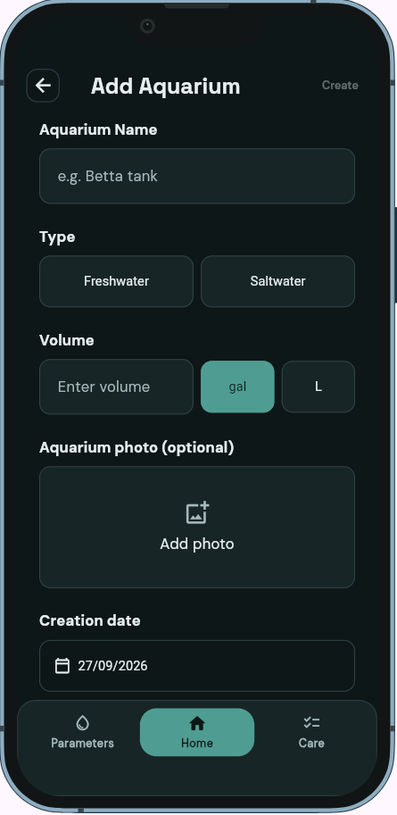
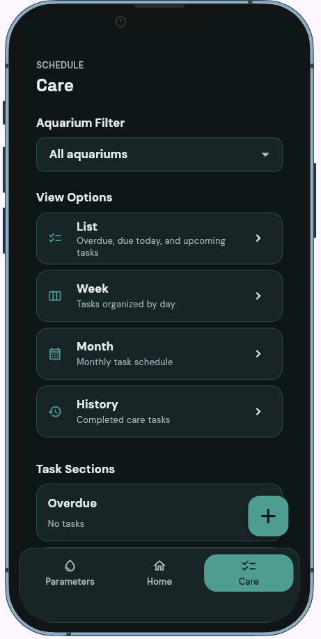

# Vivari

**Live Demo:** https://vvnrzn.github.io/Vivari/  
**Course:** Applications Development and Emerging Technologies (6ADET), Holy Angel University  
**Author:** vvnrzn  

## 1. Overview
- Vivari is a Flutter-based aquarium care app designed to help aquarium owners keep track of their aquariums, water parameters, and care tasks. It aims to bring aquarium summaries and maintenance information together in one place.

## 2. Setup and installation

The specific SDK versions used to build the app are **Flutter 3.47.2** and **Dart 3.13.2**.

To run the project:

1. Install Flutter and ensure the Flutter toolchain is on your `PATH`.
2. Clone the repository and open its folder in VS Code or a terminal.
3. Install the project dependencies:

```bash
flutter pub get
```

4. Check that Flutter can detect a connected device or emulator:

```bash
flutter devices
```

## 3. How to run it

Start the app with:

```bash
flutter run
```

For a browser preview:

```bash
flutter run -d chrome
```


## 4. Features and usage

### Home

* View total aquariums, inhabitants, tasks due today, parameter alerts, last water change, and last dosing.
* Browse aquarium cards and select an aquarium to view its details.

### Aquarium Details

* View aquarium information, tasks needing attention, and inhabitants.
* Edit aquarium details or add and manage inhabitants.

### Parameters

* Switch between aquariums and view water-quality parameters.
* Monitor temperature, ammonia, nitrite, nitrate, pH, salinity, and other enabled parameters.
* Open a parameter to view its graph, status, average, and recommended range.
* Use Parameter Settings to manage visible parameters and recommended values.

### Care

* View maintenance tasks through List, Week, Calendar, or History.
* Filter tasks by aquarium and review overdue, due today, and upcoming tasks.
* View completed tasks through History.


## 5. Project structure

```text
lib/
├── main.dart
├── models/
│   ├── aquarium.dart
│   ├── care_record.dart
│   └── water_reading.dart
├── screens/
│   ├── add_aquarium_screen.dart
│   ├── add_task_screen.dart
│   ├── aquarium_details_screen.dart
│   ├── care_screen.dart
│   ├── home_dashboard.dart
│   ├── log_activity_screen.dart
│   ├── parameters_screen.dart
│   └── placeholder_screen.dart
├── theme/
│   └── app_theme.dart
└── widgets/
    ├── aquarium_multi_select_sheet.dart
    ├── empty_state.dart
    ├── summary_card.dart
    ├── vivari_add_button.dart
    ├── vivari_bottom_navigation.dart
    └── vivari_card.dart
```

## 6. Screenshots

| HOME DASHBOARD | ADD AQUARIUM | CARE |
| --- | --- | --- |
|  |  |  |


## 7. Known issues and next steps

**Current limitations:**

**Planned next steps:**
 Add persistent storage for aquariums and their photos.


## Security

See [SECURITY-CHECKLIST.md](SECURITY-CHECKLIST.md) for the project's security review, including client configuration, GitHub Actions, and the server-side Spoonacular key.

## AI usage


GitHub Copilot and Codex were used to support the development of the app, particularly for code structure, UI patterns, and documentation. The final implementation was reviewed and adjusted by the author to match the project requirements. See [AI-USAGE.md](AI-USAGE.md) for more details. 

## LICENSE

Copyright © 2026 vvnrzn. [MIT License](LICENSE).
