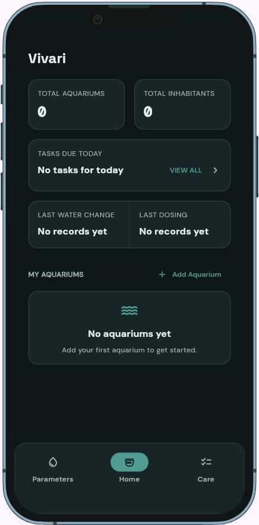

# Vivari

**Live Demo:** https://vvnrzn.github.io/Vivari/  
**Demo video:** To be added after recording.  
**Course:** Applications Development and Emerging Technologies (6ADET), Holy Angel University  
**Author:** vvnrzn  

## 1. Overview
- Vivari is a Flutter-based aquarium care app designed to help aquarium owners keep track of their aquariums, water parameters, and care tasks. It aims to bring aquarium summaries and maintenance information together in one place.

## 2. Setup and installation

The specific SDK versions used to build the app are **Flutter 3.47.2** and **Dart 3.13.2**.

To run the project:

1. Install Flutter and ensure the Flutter toolchain is on your `PATH`.
2. Clone the repository and open its folder in VS Code or a terminal.
3. Install the project dependencies:

```bash
flutter pub get
```

4. Check that Flutter can detect a connected device or emulator:

```bash
flutter devices
```

## 3. How to run it

Start the app with:

```bash
flutter run
```

For a browser preview:

```bash
flutter run -d chrome
```

The app opens to the **Home Dashboard**. Its bottom navigation provides access to **Parameters** and **Care**, which are still placeholders.

## 4. Features and usage

### Home

* View total aquariums, inhabitants, tasks due today, parameter alerts, last water change, and last dosing.
* Browse aquarium cards and select an aquarium to view its details.
* Use **+ Add Aquarium** to create a new aquarium.
* Select **Tasks Due Today** or **Parameter Alerts** to quickly open Care or Parameters.

### Aquarium Details

* View aquarium information, tasks needing attention, and inhabitants.
* Edit aquarium details or add and manage inhabitants.
* Use **+ Add Inhabitant** to add fish, invertebrates, plants, or corals.

### Parameters

* Switch between aquariums and view water-quality parameters.
* Monitor temperature, ammonia, nitrite, nitrate, pH, salinity, and other enabled parameters.
* Use **+ Add** to record measurements and quickly switch between parameters.
* Open a parameter to view its graph, status, average, and recommended range.
* Use Parameter Settings to manage visible parameters and recommended values.

### Care

* View maintenance tasks through List, Week, Calendar, or History.
* Filter tasks by aquarium and review overdue, due today, and upcoming tasks.
* Use **+ Add** to create a single or recurring task and assign it to one or more aquariums.
* View completed tasks through History.


## 5. Project structure

```text
lib/
├── main.dart
├── models/
│   └── aquarium.dart
├── screens/
│   ├── add_aquarium_screen.dart
│   ├── aquarium_details_screen.dart
│   ├── care_screen.dart
│   ├── home_dashboard.dart
│   ├── parameters_screen.dart
│   └── placeholder_screen.dart
├── theme/
│   └── app_theme.dart
└── widgets/
    ├── empty_state.dart
    ├── summary_card.dart
    ├── vivari_add_button.dart
    ├── vivari_bottom_navigation.dart
    └── vivari_card.dart
```

## 6. Screenshots

| HOME DASHBOARD | ADD AQUARIUM | CARE |
| --- | --- | --- |
|  |  |  |


## 7. Known issues and next steps

**Current limitations:**

- Aquarium creation is implemented, and new aquariums appear on the dashboard, but the data is stored only in memory and is lost when the app restarts.
- The dashboard’s inhabitant count, care tasks, water change records, and dosing records are not connected to stored data, so they remain empty.
- Aquarium Details opens for a selected aquarium, but its detail content is still a placeholder.
- Parameters has a basic screen and an add button, but parameter logging and tracking are not implemented.
- Care has a screen structure, but care tasks and maintenance records are not yet connected to app data.

**Planned next steps:**

1. Add persistent storage for aquariums and their photos.
2. Build out the Aquarium Details screen.
3. Implement parameter logging and history.
4. Connect Care to task management and maintenance records.
5. Connect dashboard summaries to saved aquarium, inhabitant, task, and maintenance data.
6. Add and document current screenshots, demo details, and project author information.

## Security

See [SECURITY-CHECKLIST.md](SECURITY-CHECKLIST.md) for the project's security review, including client configuration, GitHub Actions, and the server-side Spoonacular key.

## AI usage


GitHub Copilot and Codex were used to support the development of the app, particularly for code structure, UI patterns, and documentation. The final implementation was reviewed and adjusted by the author to match the project requirements. See [AI-USAGE.md](AI-USAGE.md) for more details. 

## LICENSE

Copyright © 2026 vvnrzn. [MIT License](LICENSE).
